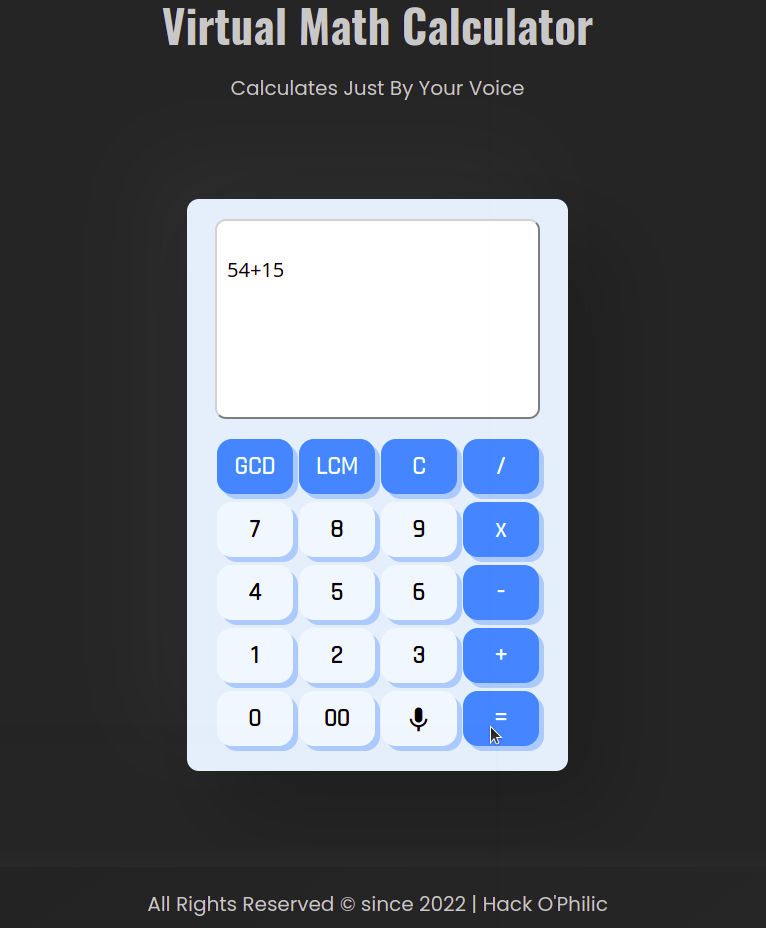
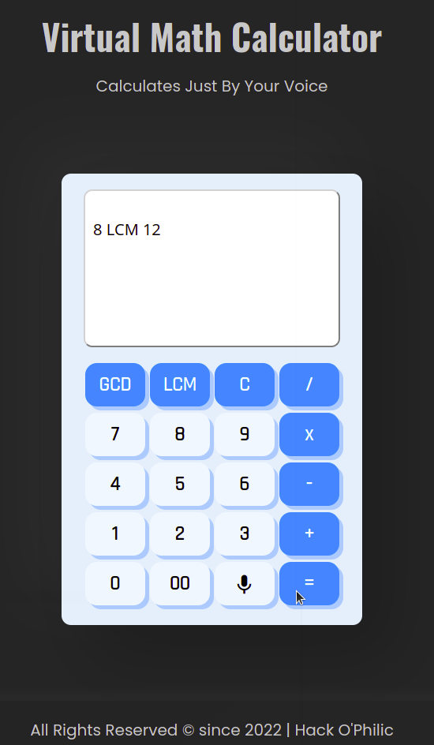
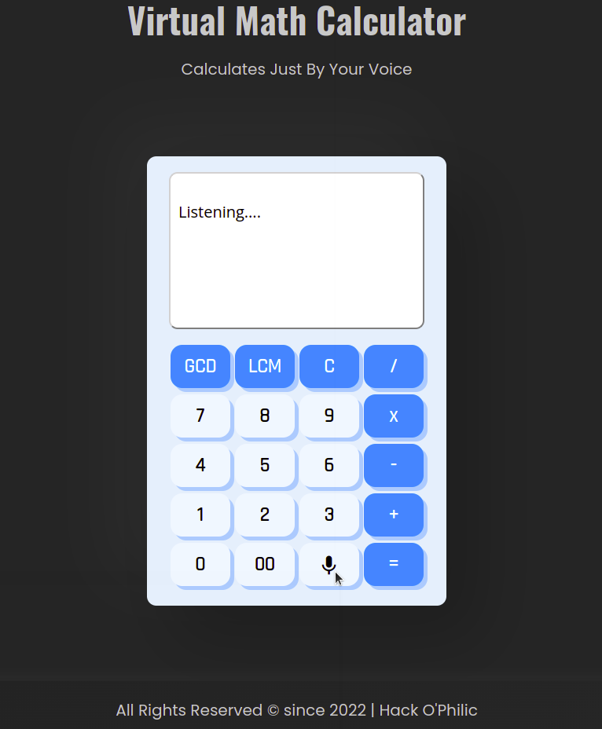
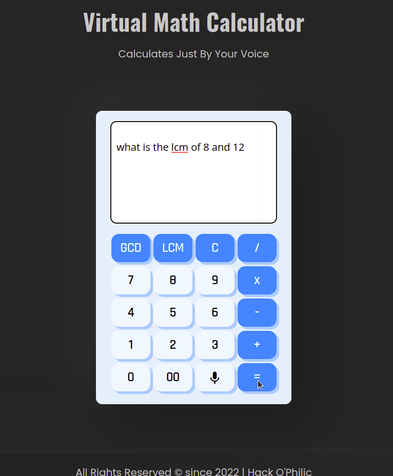

# Virtual Math Calculator

Virtual Math Calculator is special type of calculator which can deal with Voice input question and typed raw questions and evaluate the expression hidden within a sentence

It can currently only deal with two oprands and one operator in between. It can't yet solve complex expressions.

The Code is written in vanilla JS with no libraries involved. We tried to make it efficient with lesser dependencies.


## Code File Hierarchy

---- client (folder containing all client side source code)
|    |
|    --- css (folder containing the stylesheet(s))
|    |   | 
|    |    -- style.css (main stylesheet file)
|    |
|    |
|    --- js (folder containing all the javascript file(s))
|    |   |
|    |    -- main.js (main scripting file)
|    |
|    |
|    --- img (folder containing images (if any))
|    |
|    |
|    |
|    |
|    --- index.html (Main HTML File)
|
|
|
|
|
---- README.txt (This file)
|
|
|
---- Requirements.txt (File consisting of all the Requirements)


## 	Features

- [x]   Addition 
- [x]   Multiplication
- [x]   Division
- [x]   Subtraction
- [x]   LCM of two numbers
- [x]   GCD or HCF of two numbers
- [x]   Voice Input 
- [x]   Resolves random statements you say or enter containing simple evaluation problems
- [x]   Error Handling


## Technologies Used

- [x]  HTML5 
- [x]  CSS 3
- [x]  EcmaScript
- [x]  Google Fonts
- [x]  Google Material Icons


## Basic Documentation


 
### Functions used

- getDynamicResult(transcript) => Takes basic arithmetic statements and resolves it to operators and oprands and hence evaluates it 
- lcm(x, y) => Takes two numbers as input and finds there LCM
- gcd(x, y) => Takes two numbers as input and finds there HCF or GCD


### Working of Code


## Installation 

Clone this Repository to Your Local Setup

```bash
    git clone https://github.com/muteenk/Virtual-Math-Calculator.git
```

And Just simply open the index.html file, present in the client folder into your browser


## How to use

### Layout of Web App

You can use this as a normal calculator




### Calculating LCM and HCF 

You can find the LCM and GCD (HCF) 




### You can use the voice input feature of the Calculator

You can use the voice input feature to speak a arithmetic problem, like - "*What is the lcm of 8 and 12*", "*Evaluate the product of 5 times 6*" etc.




### You can manually type the problem you want to calculate 

Click and type the arithmetic operation or statement on the input screen with the help of your keyboard




## Authors

- (Muteen K)[https://github.com/muteenk/]
- (Dishu Mavi)[https://github.com/mavidishu/]